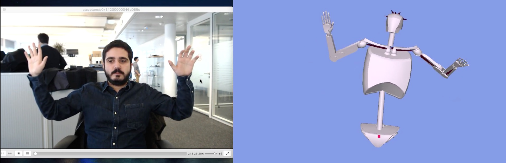
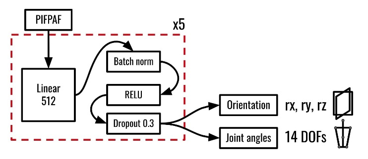
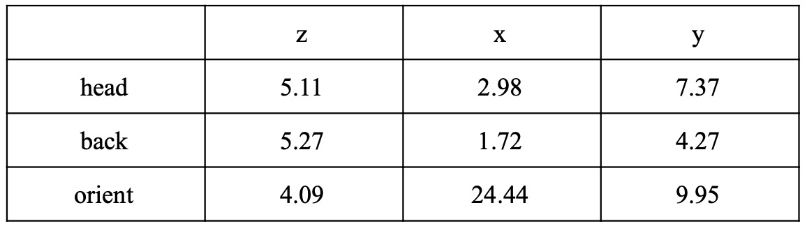
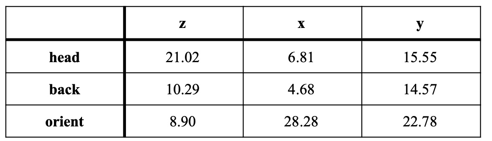

# At the Desk Posture Estimation Application
 The goal of this project is about estimating body posture in the context of working at a desk using as input RGB Webcam 
 images. This repository is the user inference application that can run on CPU and displays an avatar representation of 
 the user's posture. This is part of the Microengineering Master Thesis and Internship project by Jean Marc Bejjani 
 supervised by Ludovico Novelli at Logitech SA and Prof. Alexandre Alahi at the VITA lab, EPFL.
 


## Overview
- [Code Structure](#Code-Structure)
- [Network Architecture](#Network-Architecture)
- [Train and Dataset Generation](#Train-Dataset-Generation)
- [Requirements](#Requirements)
- [Tutorial](#tutorial)
- [Results](#Results)

## Code Structure
The code is structured as follow:

```
network/ - Contains all the Classes and Functions for processing the data and running the networks.
    pifpaf.py - Defines the Pifpaf Class to run the PifPaf 2D joints detection network.
    pose3d.py - Defines the Pose3d Class to run the 2D joints to 3D angles estimation network.
    pose3d_architecture.py - Pose3d Neural Network Class architecture.
    process.py - Process functions for images and 2D joints.
    pose2d_lib.py - Process functions for 2D poses manipulation and conversions.
    pose3d_lib.py - Process function for 3D poses manipulation.

utils/ - Contains functions for data manipulation.
    camera.py - contains functions for geometric manipulation of joints and reference changes.

visuals/ - Contains all the Classes and functions for the visual interface.
    models/ - Contains the blender 3D models of the avatar.
    client.py - Defines the functions for connecting to the Kinect Socket.
    segment.py - Defines the Segment Class for creating the Skeleton segment geometric shape.
    pose3d_viz_arm.py - Create the Panda3d engine instance and calls all the required function to update the visuals.

run.py - 
```
## Network Architecture

Here you can find the neural network architecture used in my model.




## Train and Dataset Generation

I train my model on a generated Dataset of 2D joint projections to 3D joint angles, the data generation and training
are detailed in the [training repo](https://github.com/Parrotlife/pose3d-train)

## Requirements

The code was run on python 3.7 on Ubuntu 18.04, MacOS and Windows 10.

requirements:
```
openpifpaf
panda3d
numpy
opencv
gltf
keyboard
pyquaternion
scipy
torch
socket
PIL

```

## Tutorial

### installing

You need to clone the repo in the root folder you want:

```
cd <root folder>
git clone <repo link>
mkdir data/models
```
Copy the trained model weights to the data/models directory.

install all the required dependencies detailed in [Requirements](#Requirements).
    
### Run the application

To run the application type the following command from the root folder:
```
python -m posture-app.run --webcam
```
You can edit the scale of the image size (default is 0.2) by adding ```--scale <new scale>``` to the command.

You can also define another path to the trained model with ```--pose3d_model <model path>```.

### Comparing with Kinect (optional)

To compare with the kinect SDK, you need to clone the repo: into the root folder and install the 
SDK by following the instructions in the repo.

Check that the Kinect Azure Sensor is connected.

Then you need to open a new terminal window and from the root folder enter the following commands:
```
cd Azure-Kinect-Samples/build
./bin/simple_3d_viewer
```
This will launch the SDK and the Socket waiting for a connection from the posture-app.

to finally get both results side by side in the posture-app run the application from the root folder with:
```
python -m posture-app.run --webcam
```
### Record the data

To record the data, you have to type 2 consecutive keyboard command. You need to type "a" (for activate) then "r" 
(for recording)

Then you type the same command again to stop the recording and save your data.

The data is saved in the results folder in the json format.

To interact with the data format, check the notebook in the data generation and training repo.

## Results

Here are the resulting error based on the 2 benchmarks I created:



The median absolute error in degrees for each joint angles for the evenly distributed benchmark.



The median absolute error in degrees for each joint angles for the realistic scenario benchmark.